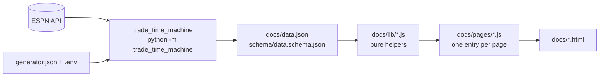

# AGENTS.md

A guide to this repository for humans and coding agents. Read it before making changes. `README.md` explains what the site shows and why; this file explains how the code is organized.

## What this is

**Trade Time Machine** is a public, read-only fantasy football site for the Lana Straw leagues (Premier and Champeens, both on ESPN). A Python generator reads ESPN once and writes a static JSON snapshot. A dependency-free static site in `docs/` renders that snapshot, and GitHub Pages publishes `docs/` from `main`.



There is no server, database, or build step at runtime. Every push to `main` republishes the site, and **everything in `docs/` is public**.

## Layout

| Path | Purpose |
| --- | --- |
| `generate.py` | Thin shim that calls `trade_time_machine.cli.main`, kept so existing commands still work. |
| `generator.json` | Season, first trade date (the cutoff), leagues, and the optional Discord allowlist. |
| `trade_time_machine/` | The generator package. `__init__.py` lists the pipeline stages in order. |
| `schema/data.schema.json` | The JSON Schema for `docs/data.json`: the contract between the generator and the site. |
| `docs/*.html` | Five pages, each loading a single `<script type="module">`. |
| `docs/lib/` | Shared frontend modules. Everything except `dom.js`, `page.js`, `swing-chart.js`, `leaderboard-charts.js` and `league-sections.js` is pure and can be imported in Node tests. |
| `docs/pages/` | One entry script per page. These modules own the DOM and the page state. |
| `tests/test_*.py` | Python unit tests, one file per module, plus the golden-snapshot and data-contract tests. |
| `tests/fixtures/` | `fake_espn.py` (a deterministic fake league), `builders.py` (small test-data builders), and `data.expected.json` (the golden output). |
| `tests/js/` | Node `node:test` unit tests that import `docs/lib/*` directly. |
| `tests/smoke/` | Playwright tests that load each served page. |
| `ToDo.md` | The roadmap. Item numbers (e.g. #14, #17) are referenced in commits and discussion. |

### Generator pipeline (`trade_time_machine/`)

1. `config.py`: loads `generator.json` into frozen dataclasses and reads ESPN credentials from the environment or `.env`.
2. `espn_source.py`: fetches the trade activity feed. When the feed is members-only (Champeens), it rebuilds trades from `mTransactions2` + `mRoster` instead.
3. `trades.py`: turns activities into trade records, with the points each side's received players scored.
4. `receipts.py`: Discord messages from a local export. Optional, and never displayed yet (see `ToDo.md` #15).
5. `standings.py`: Alternate Universe standings, i.e. the season replayed with every trade rewound.
6. `weekly_moves.py`: grades each manager's bundled trades per game week against a no-trades lineup.
7. `snapshot.py`: assembles one league's section; `cli.py` writes every league plus `schema_version`.

Two modules are shared across stages: `game_weeks.py` (calendar rules) and `lineups.py` (lineup slots, the optimal lineup, and the refill lineup). `models.py` holds the `TypedDict`s for the output and the `Protocol`s for the ESPN objects.

### Frontend (`docs/`)

- `lib/snapshot.js` checks `schema_version`, then flattens every league's trades into a single list, newest first, with league-prefixed IDs.
- `lib/trades.js`, `lib/rankings.js`, `lib/weekly-moves.js`, `lib/results.js` and `lib/format.js` are pure data functions.
- `lib/page.js` handles fetching, header badges, league options and error display. `lib/dom.js` has the element builders.
- `lib/league-sections.js` shares league grouping and collapsible section rendering between Leaderboards and Trade Charts.
- Each `pages/*.js` module reads the URL, renders the page, and wires up its filters. Page state never leaves its own module.

## Commands

```bash
python3 -m venv .venv && .venv/bin/pip install -r requirements-dev.txt
npm ci && npx playwright install chromium   # only needed for smoke tests

npm test              # Python + JS unit tests
npm run test:smoke    # Playwright smoke tests (starts a server for docs/)
npm run coverage      # Python branch coverage (fails under 95%) + JS coverage
npm run lint          # ruff check + ruff format --check
npm run dev           # http://localhost:3000/ with live reload on docs/ changes (ES modules need HTTP; file:// won't work)

npm run generate      # refresh docs/data.json from ESPN (needs .env for private leagues)
                      # pass options after --, e.g. npm run generate -- --output /tmp/data.json
```

CI (`.github/workflows/test.yml`) runs lint, `npm test` and the smoke tests on every push and pull request.

## Common changes

| Change | Where to edit |
| --- | --- |
| New season or cutoff | `generator.json` (`season_year`, `first_trade_date`) |
| Historical season data | `supabase_source.py` (fixed read-only extraction), `historical.py` (pure transform), `historical_weekly.py` (opt-in ESPN enrichment), and a reviewed historical config |
| New league | `generator.json` `leagues`; `key` must be unique and stable, since it prefixes trade IDs and URLs |
| New leaderboard | Add a ranker and a `LEADERBOARDS` entry in `docs/lib/rankings.js`, with a test in `tests/js/leaderboards.test.js` |
| New field in `data.json` | Model in `models.py`, then producer, then `schema/data.schema.json`, then the golden fixture, then the frontend (see "Changing the data contract") |
| Week or timezone rules | `trade_time_machine/game_weeks.py` and `docs/lib/format.js` (`LEAGUE_TIME_ZONE`) |
| Lineup or optimizer rules | `trade_time_machine/lineups.py` |
| Page layout or copy | `docs/*.html`, the matching `docs/pages/*.js` and `docs/styles.css` |

### Changing the data contract

1. Change the producer and its `TypedDict` in `models.py`.
2. Update `schema/data.schema.json`. For a breaking change, bump `SCHEMA_VERSION` in **both** `trade_time_machine/cli.py` and `docs/lib/snapshot.js`; the site refuses snapshots whose version it doesn't know.
3. Regenerate the golden fixture with `UPDATE_GOLDEN=1 .venv/bin/python -m unittest tests.test_snapshot_golden` and review the diff before accepting it.
4. Regenerate `docs/data.json` with the generator.
5. Run `npm test` and `npm run test:smoke`.

A refactor must not change `tests/fixtures/data.expected.json`. If the golden test fails and you didn't intend a behavior change, fix the code rather than the fixture.

## Invariants

- **League time is America/Chicago.** Dates, cutoffs and game weeks use Central time in both Python (`LEAGUE_TIMEZONE`) and JS (`LEAGUE_TIME_ZONE`).
- **Game weeks run Tuesday to Tuesday.** They turn over at 12:00 AM Central every Tuesday, after Monday Night Football; week 1 starts at `first_trade_date`. Kickoff is assumed to be the Thursday after Labor Day (`week_start`).
- **The cutoff is inclusive** and is applied in Central time. Earlier transactions are draft corrections and are ignored.
- **Only completed weeks count.** The week in progress is always excluded, and a trade's own week counts once it is complete.
- **A tie is worth 0.5 wins** everywhere: in standings, in the leaderboards (`RESULT_WINS`), and in "0.5 losses".
- **Tied rankings share a competition rank** (1, 1, 1, 4).
- **Unknown values are never zero.** Missing scores stay `null` and render as `—`.
- **Discord snowflakes are strings,** because they exceed JavaScript's safe integer range.
- **The site is read-only and public.** Never put credentials, Discord exports or private data in `docs/` or commit them. `.env`, `discord-export.json` and `supabase-schema.sql` are git-ignored.
- **Historical Supabase access is read-only by construction.** Use only `supabase_read_only_user`; the source rejects other roles and non-read-only transactions. Never add a generic SQL or mutation method.
- **MCP-only historical imports use local JSON.** Run `historical-2025-queries.sql`, keep the six raw arrays in the ignored `historical-2025-raw/` directory, and pass that directory with `historical_cli --input`. This mode never opens a database connection.
- **Historical Weekly Moves is opt-in and partial.** `historical_cli --with-weekly` reads ESPN box scores and free agents, requires explicit historical projections for departed players absent from box rosters, and records uncertain manager-weeks (including dependent opponent outcomes) in `weekly_roster_moves.omitted`. Do not publish the ignored 2025 snapshot or interpret partial leaderboards as complete.
- **Trade IDs are league-prefixed in the frontend** (`premier-<id>`) and are part of the public URLs (`archive.html?trade=`, `weekly.html?league&team&week`). Don't change their format without a redirect plan (see `ToDo.md` #17).

## Glossary

| Term | Meaning |
| --- | --- |
| **Cutoff** / `first_trade_date` | The first Central-time date whose trades count. |
| **Game week** | A Tuesday-to-Tuesday transaction interval, numbered like the NFL week it overlaps. Week 1 runs from the cutoff to the first Tuesday after kickoff, so preseason trades count as week 1. |
| **Scoring week** / scoring period | ESPN's NFL week of player points and matchups. |
| `transaction_week` | The game week in which a trade was accepted, used to filter and bundle trades. |
| `trade_week` | The completed scoring week that contains the trade. Its points count even if its games had already started, so it is marked `*`. It is `null` for trades made before kickoff or during the unfinished week. The name is kept for the data contract; read it as "scoring week of the trade". |
| **Received-player points** | Points the players a side received scored in completed weeks after the trade, bench included. This is a hypothetical hold, not the manager's actual points. |
| **Trade bundle** | Every trade one manager completed within one game week, netted, so a player bought and re-traded that week cancels out. |
| **Weekly Moves** / manager-week | One bundle compared with the lineup the manager would have had without it (`weekly_roster_moves`). |
| **No-trades alternate** | That comparison lineup: the bundle is undone (the opponent's too, if they traded that week) and the best projected lineup is chosen from what remains. |
| **Clutch / Oof** | The badge shown when the real matchup result beat or lost to the no-trades alternate. Points alone never set a badge. |
| **Rewind** | Alternate Universe: traded players are returned to the team that first sent them, for every week after the trade. |
| **Current optimal / No trades** | Alternate Universe columns: the best lineup from the actual roster, versus the best lineup after rewinding. Δ wins compares these two. |
| **Reconstructed** | A Champeens trade rebuilt from transactions and roster history because its activity feed is members-only. It may be missing players. |
| **Receipts** | Discord messages near a trade that mention its players. Generated from a local export only, and not displayed. |
| **Swing** | The signed point difference between an actual result and an alternate result. |
